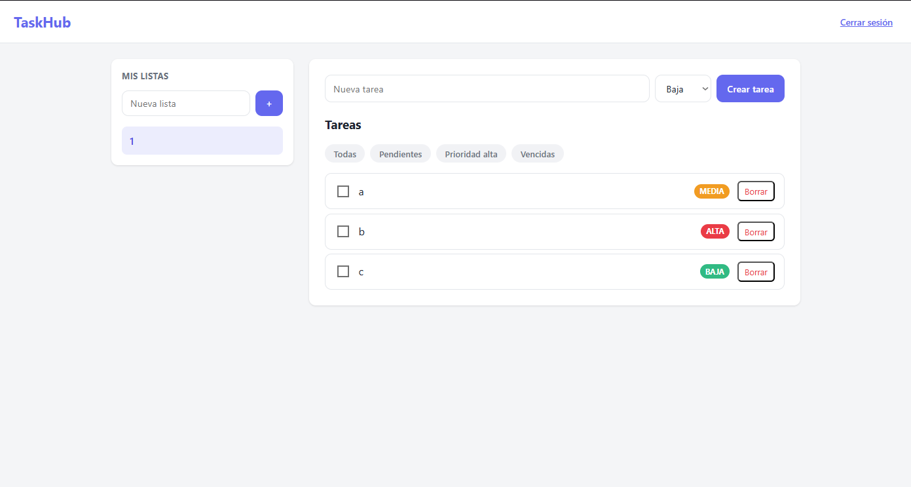
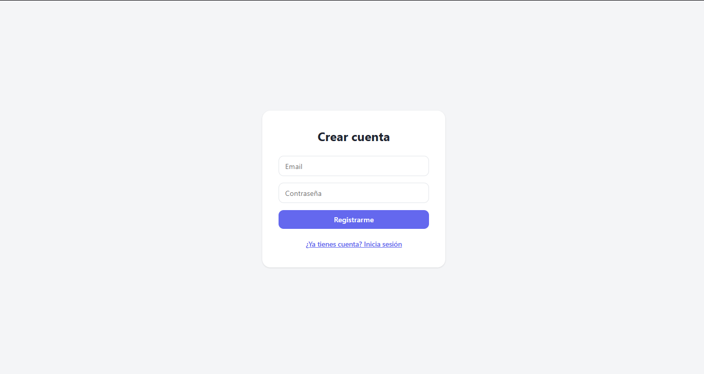

# 📋 TaskHub

*[English version](README.en.md)*

Gestor de tareas full-stack estilo Todoist/TickTick. Cada usuario organiza sus
tareas en listas, con prioridades, fechas límite y filtros.

**🌐 [Probar la demo en vivo](https://task-hub-plum.vercel.app)**

> Nota: el backend usa el plan gratuito de Render y se suspende tras unos minutos
> de inactividad, por lo que la primera carga puede tardar ~50 segundos en
> despertar. Después funciona con normalidad.





## Por qué este proyecto

Quería aprender las cosas desde cero haciéndolas yo mismo, entendiendo el porqué
de cada decisión en vez de copiar y pegar código de un tutorial. Más que la
estructura del código, me interesaba entender **cómo funcionan las cosas por
dentro**: por qué se hashea una contraseña, por qué una query parametrizada
previene una inyección SQL, por qué un token se valida en cada petición.

TaskHub es el resultado: una aplicación full-stack construida pieza por pieza,
priorizando la seguridad y las buenas prácticas de backend sobre la cantidad de
features.

## Características

- Autenticación con registro e inicio de sesión mediante JWT.
- CRUD completo de listas, asociadas a cada usuario.
- CRUD de tareas dentro de una lista, con prioridad y fecha límite.
- Marcar tareas como completadas.
- Filtros combinables: solo pendientes, prioridad alta o tareas vencidas.
- Aislamiento total entre usuarios: cada uno solo accede a sus propios datos.

## Stack

**Backend:** Node.js, Express 5, TypeScript, PostgreSQL (driver `pg` con SQL
nativo), `jsonwebtoken`, `bcrypt` y `zod`.

**Frontend:** React 19, TypeScript y Vite.

## Estructura

```
TaskHub/
├── backend/
│   └── src/
│       ├── routes/          # definición de endpoints
│       ├── controllers/     # traducen HTTP <-> lógica
│       ├── services/        # lógica de negocio + queries SQL
│       ├── middlewares/     # auth, validación, manejo de errores
│       ├── schemas/         # validación de entrada con Zod
│       ├── errors/          # clases de error con su status HTTP
│       └── db.ts            # pool de conexión a PostgreSQL
└── frontend/
    └── src/
        ├── App.tsx          # estado y lógica principal
        ├── Login.tsx / Registro.tsx
        ├── ListaItem.tsx / TareaItem.tsx   # componentes reutilizables
        └── types.ts         # tipos compartidos
```

## Instalación

Requisitos: Node.js 22.12+ (o 24 LTS) y PostgreSQL.

**1. Base de datos**
```sql
CREATE DATABASE taskhub;
```
Ejecuta luego los `CREATE TABLE` de `backend/db/schema.sql`.

**2. Backend**
```bash
cd backend
npm install
# crea tu archivo .env basándote en .env.example
npm run dev          # http://localhost:3000
```

**3. Frontend**
```bash
cd frontend
npm install
npm run dev          # http://localhost:5173
```

## API

| Método | Ruta | Descripción | Auth |
|--------|------|-------------|------|
| POST | `/auth/register` | Crear cuenta (devuelve token) | No |
| POST | `/auth/login` | Iniciar sesión (devuelve token) | No |
| GET | `/listas` | Listas del usuario | Sí |
| POST | `/listas` | Crear lista | Sí |
| PATCH | `/listas/:id` | Editar lista | Sí |
| DELETE | `/listas/:id` | Borrar lista | Sí |
| GET | `/listas/:listaId/tareas` | Tareas de una lista (admite filtros) | Sí |
| POST | `/listas/:listaId/tareas` | Crear tarea | Sí |
| PATCH | `/tareas/:id` | Editar / completar tarea | Sí |
| DELETE | `/tareas/:id` | Borrar tarea | Sí |

Filtros (query params en `GET /listas/:listaId/tareas`, combinables):
`?estado=pendiente`, `?prioridad=alta`, `?vencidas=true`.

Las rutas protegidas requieren el header `Authorization: Bearer <token>`.

## Decisiones técnicas

Estas son las decisiones de diseño que tomé conscientemente y el porqué de cada una:

- **Contraseñas hasheadas con bcrypt.** Nunca se guardan ni se devuelven en
  texto plano. Si la base de datos se filtrara, las contraseñas reales seguirían
  protegidas.
- **Queries parametrizadas en todas las consultas.** Los valores del usuario
  viajan como parámetros (`$1`, `$2`), nunca concatenados en el SQL. Así es
  imposible una inyección SQL: la base de datos trata la entrada como dato, no
  como código.
- **Respuestas opacas en autenticación.** El login devuelve el mismo `401` tanto
  si el email no existe como si la contraseña es incorrecta, para no revelar qué
  cuentas existen (*user enumeration*). Por la misma razón, acceder a un recurso
  ajeno devuelve `404`, no `403`.
- **Autorización por usuario en cada query.** La identidad sale siempre del token
  (`req.user.id`), nunca de datos que envíe el cliente. Toda consulta filtra por
  ese id, de modo que un usuario no puede ver ni tocar recursos de otro.
- **Validación en dos capas (defensa en profundidad).** Zod valida la entrada en
  el backend y responde un `400` claro antes de tocar la base de datos; las
  constraints de PostgreSQL (`CHECK`, `NOT NULL`) quedan como última red de
  seguridad si algo se escapa.
- **Manejo de errores centralizado.** Un middleware único traduce cada error a su
  status HTTP correcto (`404`, `409`, `400`...) mediante clases de error propias,
  en vez de repetir `try/catch` en cada controlador.
- **`ON DELETE CASCADE` en las claves foráneas.** Borrar un usuario elimina en
  cascada sus listas, y borrar una lista elimina sus tareas, sin dejar datos
  huérfanos.
- **Arquitectura en capas** (routes → controllers → services → db) en el backend
  y componentes reutilizables en el frontend, separando responsabilidades para
  que el código sea fácil de mantener y extender.

## Qué aprendí

Más que escribir código que funcione, este proyecto me sirvió para entender
**cómo funcionan las cosas por dentro**: el ciclo de una petición autenticada, por
qué el estado en React debe tratarse de forma inmutable, cómo se relacionan las
tablas mediante claves foráneas, y por qué la seguridad no es una capa que se
añade al final sino decisiones que se toman en cada paso.

## Mejoras futuras

- Etiquetas (relación N:M) para clasificar tareas.
- Subtareas.
- Tests automatizados.
- Compartir listas entre usuarios.

## Autor

Jorge — Estudiante de Ingeniería de Sistemas.
